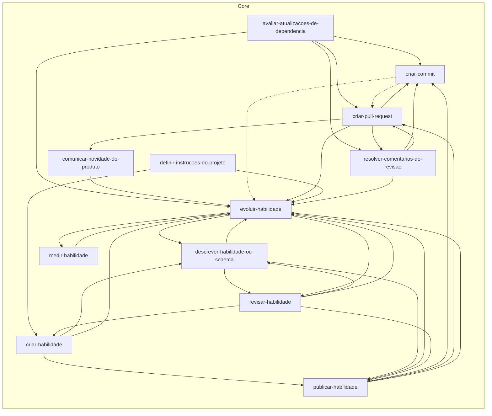

# Skills

<!-- Generated by skill-graph from jimmyandrade/harness. Do not edit by hand. -->

Solid arrows come from `metadata.related`. Dotted arrows are skills cited in the body of a skill that does not declare `metadata.related` yet.

