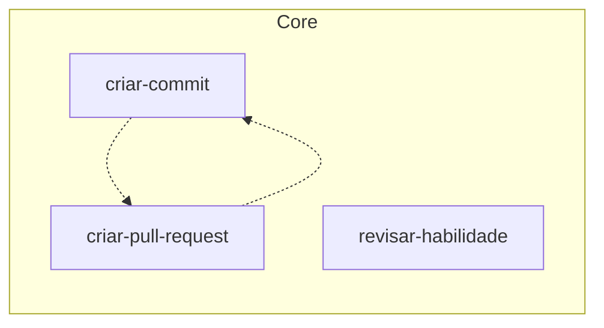

# Skills

<!-- Generated by skill-graph from jimmyandrade/harness. Do not edit by hand. -->

## Graph

Solid arrows come from `metadata.related`. Dotted arrows are skills cited in the body of a skill that does not declare `metadata.related` yet.

## Skills

| Skill | Layer | Version | Depends on | Used by |
| --- | --- | --- | --- | --- |
| `criar-commit` | Core | 0.2.0 | `criar-pull-request` | `criar-pull-request` |
| `criar-pull-request` | Core | 0.4.0 | `criar-commit` | `criar-commit` |
| `revisar-habilidade` | Core | 0.2.6 | — | — |
