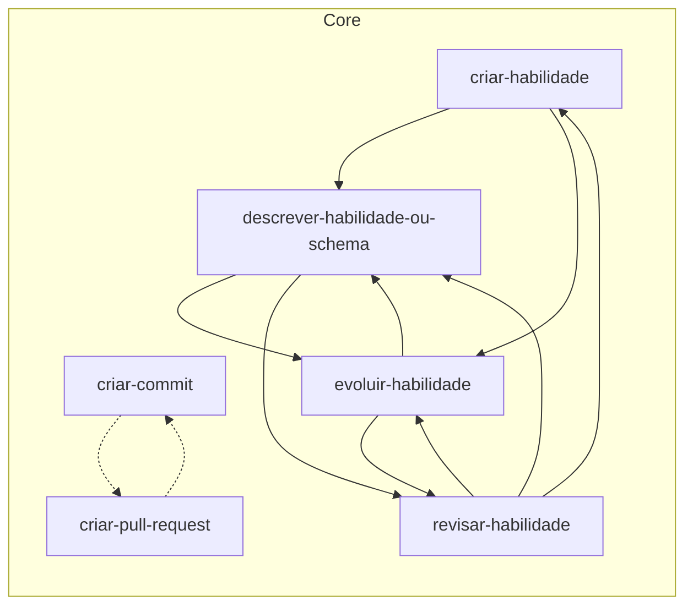

# Skills

<!-- Generated by skill-graph from jimmyandrade/harness. Do not edit by hand. -->

## Graph

Solid arrows come from `metadata.related`. Dotted arrows are skills cited in the body of a skill that does not declare `metadata.related` yet.

## Skills

| Skill | Layer | Version | Depends on | Used by |
| --- | --- | --- | --- | --- |
| `criar-commit` | Core | 0.2.0 | `criar-pull-request` | `criar-pull-request` |
| `criar-habilidade` | Core | 3.6.0 | `descrever-habilidade-ou-schema`, `evoluir-habilidade` | `revisar-habilidade` |
| `criar-pull-request` | Core | 0.4.0 | `criar-commit` | `criar-commit` |
| `descrever-habilidade-ou-schema` | Core | 0.15.3 | `evoluir-habilidade`, `revisar-habilidade` | `criar-habilidade`, `evoluir-habilidade`, `revisar-habilidade` |
| `evoluir-habilidade` | Core | 0.15.5 | `descrever-habilidade-ou-schema`, `revisar-habilidade` | `criar-habilidade`, `descrever-habilidade-ou-schema`, `revisar-habilidade` |
| `revisar-habilidade` | Core | 0.2.9 | `criar-habilidade`, `descrever-habilidade-ou-schema`, `evoluir-habilidade` | `descrever-habilidade-ou-schema`, `evoluir-habilidade` |
