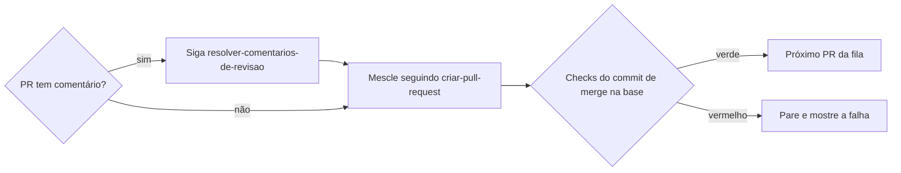

# Avaliar atualizações de dependência

## Parâmetros de configuração

Leia cada valor nas instruções do projeto: primeiro na entrada com o nome desta habilidade, depois na entrada `Global` ou no primeiro nível do bloco. Quando um valor não estiver lá, use o padrão abaixo. `Repositório` vem do remoto `origin` quando as instruções não dizem.

```yaml
"Repositório": ""
"Autores dos bots":
  - "app/dependabot"
  - "app/renovate"
"Comando de instalação": "npm ci"
"Comando de testes": ""
"Comando de build": ""
"Revisores": ""
"Modo de aprendizado": "perguntar"
```

## Instruções

### Passo 1

Liste os PRs abertos de cada um dos `Autores dos bots`, do mais antigo ao mais novo. Mostre a fila como checklist na conversa e atualize a cada PR. Trate um PR por vez, sempre o mais antigo.

### Passo 2

Mude para a branch do PR e veja quantos commits ela está atrás da base. Se estiver em conflito, peça rebase ao bot e espere a branch nova. Se só estiver muito atrás, sem conflito, avalie num merge local da branch com a base, sem enviá-lo, em vez de esperar o bot. Rode o `Comando de instalação`. Se o PR muda um subprojeto com manifesto próprio, instale, teste e faça o build nele, com os comandos dele, e não na raiz. Ache o pacote atualizado e veja se ele é direto ou transitivo. Se for transitivo, suba pela árvore até o pacote direto. Procure também imports do pacote transitivo no código: se o projeto o importa, ele é ponto de uso direto, mesmo fora do manifesto. Numa action do GitHub, a própria action é o pacote direto. Registre a cadeia na checklist.

### Passo 3

Compare a versão que o PR traz com a mais recente do pacote direto. Leia as notas de cada versão do intervalo do PR, no repositório do pacote. Num salto grande, a descrição do PR do bot corta as versões mais antigas. Sem notas nem repositório público, compare a API pública das duas versões, como os arquivos de tipos. Aponte breaking change, correção de segurança e exigência de peer dependency. Breaking change sem migração clara no projeto para a fila: pergunte à pessoa. Se as notas mudam retry, timeout ou prazo, meça o caminho degradado do projeto antes e depois e leve o número para a análise.

### Passo 4

Ache cada ponto de uso do pacote direto, no código e nos testes. Numa action, os pontos de uso são os jobs que a usam. Numa ferramenta de desenvolvimento, como bundler ou executor de testes, os pontos de uso são as ferramentas e os comandos que a rodam, não imports no código. Num linter ou formatador, compare a contagem de avisos por regra antes e depois, só nos arquivos versionados. Confira se cada ponto tem teste de integração: o teste exercita o código do projeto usando o pacote e falharia se a integração quebrasse. Nunca teste o pacote em si, que já tem os próprios testes. Num pacote que lê conteúdo do projeto, como traduções ou esquemas, passe todo esse conteúdo pela versão nova, sem gravar teste. Se faltar, escreva o teste na própria branch do PR, seguindo `criar-commit`, e envie a branch.

### Passo 5

Rode o `Comando de testes` e o `Comando de build`. Rode também as suítes e os builds que usam o pacote e ficam fora desses comandos, quando as instruções do projeto os listam. Se a atualização quebrar o código do projeto, corrija na própria branch do PR, seguindo `criar-commit`, e envie a branch. Falha que pede decisão de produto, e não só código, para a fila: pergunte à pessoa.

### Passo 6

Peça revisão aos `Revisores`. Sem revisores, comente no PR a análise: a cadeia de dependência, os riscos das notas de versão e os testes acrescentados.

### Passo 7



Os checks da base são os do commit de merge, de qualquer serviço: workflow, deploy ou outro. A fila termina quando não sobra PR de nenhum dos `Autores dos bots`.

### Passo 8

Ao terminar, siga `evoluir-habilidade` conforme `Modo de aprendizado`.

## Problemas comuns

### PR mais novo primeiro

Se você começar pelo PR mais novo, os mais antigos passam a conflitar no lockfile e o bot precisa refazê-los.

1. Ordene pela data de criação.
2. Só passe ao próximo depois do CI verde na base.

### Busca só pelo pacote transitivo

Se você procurar os pontos de uso do pacote transitivo, não acha nada, porque o projeto importa o pacote direto.

1. Suba pela árvore até o pacote direto.
2. Procure os pontos de uso dele.

### Teste num PR separado

Se você abrir outro PR só com o teste, a atualização entra sem a cobertura que justificaria o merge.

1. Commite o teste na branch do bot.
2. Envie a branch e siga no mesmo PR.

## Exemplos de entrada e saída

Estes exemplos ilustram fatos. Eles podem não estar no data source.

### processa os PRs do Renovate

Fila com três PRs, do mais antigo ao mais novo. No primeiro, o pacote é direto e as notas de versão só trazem correções. Os dois pontos de uso já tinham teste, testes e build passaram, o PR não tinha comentário, o merge seguiu `criar-pull-request` e o CI da base ficou verde. Só então o segundo PR começou.

### o Dependabot atualizou uma biblioteca que eu nem uso

A biblioteca era transitiva. A árvore levou ao pacote direto que a puxa, e os pontos de uso desse pacote não tinham teste. O teste entrou na branch do bot, a branch foi enviada e a análise foi comentada no PR, porque o projeto não lista revisores.

## Casos-limite

- O bot já substituiu o PR por um mais novo do mesmo pacote: siga o mais novo.
- O PR agrupa vários pacotes: faça os passos 2 a 4 para cada um. Um pacote 0.x do grupo pode quebrar ao subir o minor: leia as notas dele à parte.
- A atualização de major espera aprovação no painel de dependências e ainda não virou PR: fica fora da fila.
- Dois PRs conflitam depois de um merge e a ordem fica ambígua: pergunte à pessoa.
- O pacote baixa binários presos à versão, como os navegadores de teste: diga na análise que cada máquina precisa baixá-los de novo depois do merge.
- O pacote vai num artefato publicado à parte, como um worker ou uma função: o merge não atualiza o que está rodando. Diga na análise que falta publicar de novo.
- Uma revisão obrigatória que você não consegue cumprir bloqueia o merge: pare e diga quem precisa aprovar.
- O PR atualiza um pacote sem os que andam junto com ele, como os tipos, a peer dependency ou outro pacote do mesmo monorepo: pare e proponha agrupá-los, em `packageRules` com `groupName` no Renovate ou em `groups` no Dependabot.

## Pegadinhas

- Depois que outra pessoa envia commit para a branch, o Dependabot para de fazer rebase dela e o Renovate para de atualizá-la. Daí em diante, quem mantém a branch em dia é você.
- Uma mudança que depende do ambiente de execução, como bloquear algo no navegador, vale também para o ambiente dos testes, como jsdom. Confira o ambiente configurado para os testes.
- Alguns pacotes regravam arquivos versionados na instalação, como o script de service worker do msw. Depois de instalar, confira se a árvore de trabalho mudou e commite esses arquivos na branch do PR: o bot só muda o manifesto e o lockfile.
- Uma atualização só de tipos pode quebrar a checagem de tipos e o build sem falhar nenhum teste. Rode o build mesmo com os testes verdes.
- A instalação limpa apaga o que foi instalado dentro da pasta de dependências, como o navegador de testes. As suítes fora do `Comando de testes` podem pedir esse passo de novo, e também as variáveis de ambiente do projeto.
- A árvore de dependências só mostra o pacote depois da instalação na branch do PR. Antes dela, ela mostra a versão antiga ou nada.

## Scripts disponíveis

- `gh pr list --repo <Repositório> --author <autor> --state open --json number,title,createdAt,url --jq 'sort_by(.createdAt)[]'`: fila do Passo 1, uma vez por autor.
- `gh pr checkout <número> --repo <Repositório>`: branch do Passo 2.
- `npm ls <pacote> --all`: árvore do Passo 2.
- `npm view <pacote> version`: versão mais recente do Passo 3.
- `gh release view <tag> --repo <repositório do pacote>`: notas de versão do Passo 3.
- `gh pr edit <número> --repo <Repositório> --add-reviewer <pessoa>`: revisão do Passo 6.
- `gh run watch <id da execução> --repo <Repositório> --exit-status`: CI da base do Passo 7.

1. Monte a fila, depois, para cada PR: branch, árvore, notas de versão, pontos de uso e testes, verificações, revisão, comentários, merge e CI da base.
