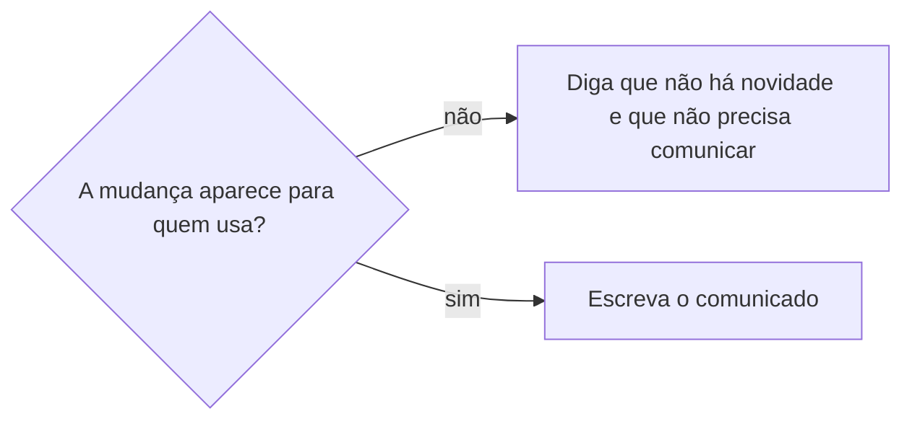

# Comunicar novidade do produto

## Parâmetros de configuração

Leia cada valor nas instruções do projeto. Quando um valor não estiver lá, use o padrão abaixo.

```yaml
"Público do comunicado": ""
"Canal do comunicado": ""
"Idioma do comunicado": "português"
"Modo de aprendizado": "perguntar"
```

## Instruções

### Passo 1

Junte o que entrou: um PR mesclado, vários, ou um período. Leia o título, a descrição, os arquivos alterados e as issues ligadas de cada um. Quando o pedido inclui outras ferramentas, como o Notion, junte também o que a pessoa criou ou editou nelas no período.

### Passo 2

Decida se há novidade para o `Público do comunicado`. Sem público definido, o público é o time.



Sem novidade: dependência, refatoração, CI, teste, documentação interna, reunião. Com novidade: tela, texto, fluxo, comportamento, desempenho que se nota, correção de algo que alguém sentia, dado novo ou que sumiu, e organização dos dados que o público usa, como cadastros consolidados, bancos reorganizados e páginas antigas retiradas.

### Passo 3

Escreva o comunicado no `Idioma do comunicado`, para quem não é técnico: o que muda na prática, onde a pessoa percebe, quem é afetado, se precisa fazer algo e a partir de quando. Nunca cite PR, commit, biblioteca, arquivo nem ferramenta interna. Conte a correção pelo problema que a pessoa sentia: "corrigimos um problema que fazia a página demorar", não o novo comportamento isolado. Um período vira um comunicado só, agrupado por área e com o intervalo corrido no título, como "últimos 15 dias", sem uma seção por semana ou sprint.

### Passo 4

Entregue no `Canal do comunicado`, com a formatação dele. Se houver uma ferramenta para esse canal, mostre o texto e peça o ok antes de publicar. Se não houver, ou se o canal estiver vazio, entregue o texto pronto para copiar.

### Passo 5

Ao terminar, siga `evoluir-habilidade` conforme `Modo de aprendizado`.

## Problemas comuns

### Jargão no comunicado

Se você escrever "refatoramos o adaptador", quem não é técnico não sabe o que mudou para ele.

1. Troque pelo efeito que a pessoa percebe.
2. Se não houver efeito, não há novidade.

### Comunicado sem novidade

Se você comunicar uma mudança que ninguém percebe, o público passa a ignorar os comunicados.

1. Classifique pelo Passo 2.
2. Sem novidade, diga em uma frase que não precisa comunicar e pare, mesmo que a pessoa tenha pedido o comunicado.

### Publicação sem ok

Se você publicar no canal sem mostrar o texto, a pessoa perde a chance de corrigir.

1. Mostre o texto.
2. Publique só depois do ok.

### Correção contada pelo resultado

Se você escrever "a página parou de pedir a localização", a pessoa não reconhece o problema que ela sentia.

1. Comece com "corrigimos um problema que".
2. Descreva o incômodo como a pessoa o percebia.

### Ação escondida

Se você deixar de dizer que a pessoa precisa fazer algo, a mudança vira problema para ela.

1. Diga o que fazer e até quando.

## Exemplos de entrada e saída

Estes exemplos ilustram fatos. Eles podem não estar no data source.

### o que mudou hoje no site?

Três PRs entraram: duas atualizações de dependência e uma correção no formulário de contato. Só a correção aparece para quem usa. O comunicado diz que o campo de WhatsApp voltou a aceitar números com nono dígito e que nada precisa ser feito.

## Casos-limite

- Vários PRs da mesma frente: um comunicado só, agrupado.
- O merge não coloca no ar, como um worker, uma release ou um deploy agendado: diga quando a pessoa vai ver a mudança, não quando o PR entrou.
- A mudança tira algo que as pessoas usavam: diga o que usar no lugar.

## Pegadinhas

- WhatsApp não é Markdown: o negrito é `*texto*`, com um asterisco, o itálico é `_texto_`, e não há título, separador nem link `[texto](url)`. Entregue o texto num bloco de código, para a formatação não se perder ao copiar.
- O tipo no título do PR engana: um `fix` pode mudar o que a pessoa vê, e um `chore` pode mudar um texto da tela. Classifique pelo diff, não pelo tipo.

## Scripts disponíveis

- `gh pr view <número> --repo <repositório> --json title,body,files,closingIssuesReferences`: o que mudou no Passo 1.
- `gh pr list --repo <repositório> --state merged --search "merged:>=<data>"`: PRs de um período no Passo 1.

1. Liste os PRs, leia cada um, classifique, escreva e entregue.
