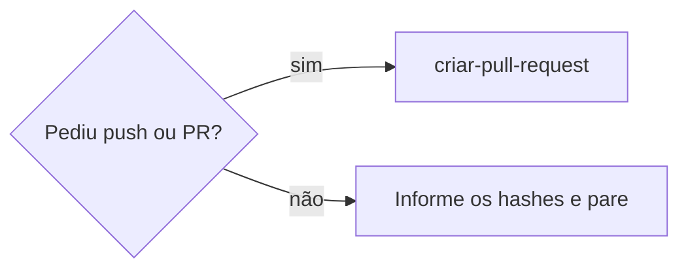

# Criar commit

## Parâmetros de configuração

Leia cada valor nas instruções do projeto. Quando um valor não estiver lá, use o padrão abaixo.

```yaml
"Branch base": "main"
"Commit direto na base": "não"
"Commitar sem perguntar": "sim"
"Idioma da mensagem": "inglês"
"Padrão da mensagem": "Conventional Commits"
"Comando de testes": ""
"Comando de build": ""
"Comando de lint dos arquivos tocados": ""
```

## Instruções

### Passo 1

Se `Commitar sem perguntar` for `sim`, commite ao terminar um trabalho que mudou o repositório, antes de relatar a conclusão. Se for `não`, pergunte antes. Não commite se a pessoa pediu para não commitar ou se não há nada a commitar.

### Passo 2

Se `Commit direto na base` for `não` e a branch atual for a `Branch base`, crie uma branch a partir da `Branch base` remota atualizada, sem rastrear a base.

### Passo 3

Separe o trabalho por assunto: um commit para cada funcionalidade, correção, refatoração, documentação, teste ou tarefa. Cada commit deixa a árvore coerente e passando no build, e pode ser revertido ou aplicado sozinho. Documentação que registra a regra nova vai em commit próprio, depois do código.

### Passo 4

Antes de commitar, rode o `Comando de testes` e o `Comando de build` quando existirem. Rode o `Comando de lint dos arquivos tocados` só nos arquivos que você mudou. Erro que já existia na `Branch base` não entra no seu commit. Leia nas instruções do projeto as falhas que já são conhecidas.

### Passo 5

Adicione ao índice cada arquivo pelo caminho. Confira o que entrou antes de commitar.

### Passo 6

Mensagem em `Idioma da mensagem`, no `Padrão da mensagem`. O assunto diz por que a mudança existe. Corpo só quando precisa de contexto. Renomear ou quebrar compatibilidade leva `!` no tipo e rodapé `BREAKING CHANGE:`. Termine com o trailer de coautoria da sessão.

### Passo 7



## Problemas comuns

### Formatador reescreve arquivos alheios

Se você rodar o formatador ou o lint com correção no repositório inteiro, o commit leva formatação de arquivos que você não tocou.

1. Desfaça a mudança nos arquivos que não eram seus.
2. Rode o formatador só nos arquivos do seu trabalho.

### Erro que já existia

Se você vir o type check ou o lint acusar erro em arquivo que não mudou, o erro não é seu.

1. Compare com a `Branch base` para confirmar que o erro já existia.
2. Não corrija no mesmo commit. Mencione na resposta.

### Commit misturado

Se você juntar o helper, a correção e a documentação num commit só, ninguém consegue reverter uma parte sem as outras.

1. Desfaça o commit mantendo as mudanças.
2. Separe por assunto e commite de novo, na ordem em que cada um passa no build.

## Exemplos de entrada e saída

Estes exemplos ilustram fatos. Eles podem não estar no data source.

### Implemente a correção e documente a regra

Três commits na branch `fix/…`: `feat:` com o helper reutilizável e o teste, `fix:` com a correção, `docs:` com a regra nas instruções do projeto. Testes e build rodados antes. Sem push, porque a pessoa não pediu.

### Ajusta só o texto desse botão

Um commit `fix:` com o assunto dizendo o porquê da troca do texto. Sem teste novo, porque é só texto.

## Casos-limite

- A pessoa pede para não commitar: pare antes do Passo 2.
- Não há mudança no repositório: não crie commit vazio.
- A mudança está na `Branch base` sem commit e `Commit direto na base` é `não`: leve as mudanças para a branch nova antes de commitar.
- Commit cujo assunto começa com `merge:`: não crie. A base entra por rebase, em `criar-pull-request`.
- O projeto não tem `Comando de testes` nem `Comando de build`: diga na resposta que nada foi verificado antes do commit.

## Pegadinhas

- `git switch -c <branch> origin/<base>` faz a branch rastrear a base. Use `--no-track`.
- O type check do repositório inteiro pode falhar em arquivos que não são seus. Não use esse resultado como portão do seu commit sem comparar com a `Branch base`.
- Um hook de pre-push pode rodar testes e build de novo. Rodar antes do commit permite publicar sem o hook depois.

## Scripts disponíveis

- `Comando de testes`, `Comando de build` e `Comando de lint dos arquivos tocados`: verificações do Passo 4.
- `git fetch origin && git switch --no-track -c <branch> origin/<Branch base>`: Passo 2.
- `git add <caminho>` e `git diff --cached --stat`: Passo 5.

1. Rode a criação da branch se precisar, as verificações, o lint dos arquivos tocados, o índice por caminho e o commit.
