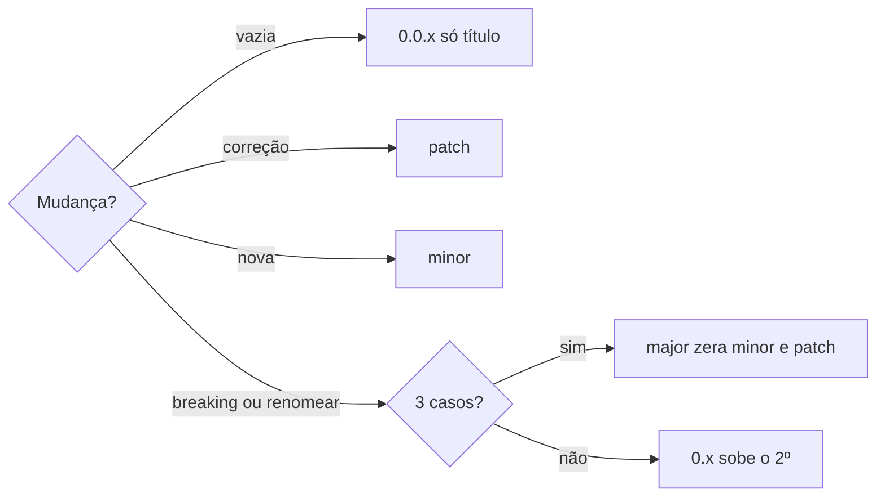

# Criar habilidade

## Parâmetros de configuração

```yaml
"Tokens do catálogo": 100
"Linhas": 500
"Tokens do corpo": 5000
```

## Instruções

### Passo 1

Crie ou atualize a skill a partir de uma tarefa prática que a pessoa está realizando com um agente. Peça o contexto do domínio antes de escrever. Não complete com conhecimento geral do modelo.
Extraia e insira na skill as etapas que funcionaram, na sequência que levou ao sucesso. Extraia as correções, como trocar uma biblioteca ou verificar um caso de borda. Extraia o formato da entrada e da saída. Extraia fatos, convenções e restrições do projeto que o agente ainda não sabia.

### Passo 2

Sintetize a skill a partir de material específico do projeto. Não use artigo genérico de melhores práticas.
Bons materiais: documentação interna, runbook, POP e guia de estilo. Especificação de API, esquema e configuração. Comentário de revisão e relato de problema, pelo que se repete e pelo que o revisor espera. Histórico de versão, pelo patch e pela correção. Caso real de falha e a resolução.
Leia relatórios reais da equipe. Incorpore o esquema, o modo de falha e o procedimento de recuperação que eles mostram.

### Passo 3

Escreva nome, descrição, metadados e corpo.
O primeiro heading de nível 2 é `Parâmetros de configuração`, com um bloco `yaml`. O passo cita a chave. Depois vêm `Instruções`, `Problemas comuns`, `Exemplos de entrada e saída`, `Casos-limite`, `Pegadinhas` e `Scripts disponíveis`. A primeira frase é `Estes exemplos ilustram fatos. Eles podem não estar no data source.` A entrada é um heading de nível 3 e a saída é o parágrafo seguinte, com uma linha em branco entre pares. Não escreva `Entrada:` nem `Saída:`. Cada heading de nível 3 em `Instruções` é `Passo 1`, `Passo 2`. Roteamento para outra habilidade, ou mais de um desfecho, fica num flowchart Mermaid no sentido configurado. Em `Problemas comuns`, cada problema é um heading de nível 3, um parágrafo que começa com `Se você` e, em seguida, uma lista ordenada.

### Passo 4

Em `Pegadinhas`, imediatamente antes de `Scripts disponíveis`, liste o fato do ambiente que contraria o que o agente suporia. Não escreva conselho geral.
O fato fica no `SKILL.md`. Um arquivo separado só serve se a frase disser quando abrir. Se o problema não for óbvio, o agente não reconhece o momento de abrir.

### Passo 5

1. Catálogo, em todo turno em que uma skill pode ser escolhida: nome e descrição. No Notion, Usar automaticamente lê a Descrição para decidir se carrega a skill.
2. Corpo, quando a skill roda. No Notion, isso é o corpo da página.
3. Material além do corpo, quando aberto. No Notion, entra em Files. Não acrescente.

### Passo 6

Escreva a descrição e o corpo no idioma deste texto.
Escreva o nome nesse idioma e depois em kebab-case ASCII: tire acentos. De 1 a 64 caracteres. A primeira palavra é o verbo. As seguintes formam a entidade. Para saber se algo já existe, o verbo é `procurar`. Cadastrar, revisar e editar a mesma entidade usam `definir`, numa skill só. Só cadastrar usa `criar`. Só revisar usa `revisar`. Venda ou despesa usa `lancar`, e `lançar` vira `lancar`. Outro trabalho usa outro verbo. Apagar, excluir e deletar não ganham skill. Só letras minúsculas, dígitos e hífen. Não comece nem termine com hífen. Sem hífens consecutivos. O nome é igual à pasta da skill.
Se o escopo da skill, de um script ou de um workflow mudar, o nome muda junto. O nome descreve o escopo atual. Renomear a skill continua breaking change.

### Passo 7

- Título: nível 1. O nome com espaço no lugar do hífen e a grafia correta, com acento e hífen da palavra. Maiúscula só no começo e em nome próprio.
- Descrição: segue `descrever-habilidade-ou-schema`. `Use essa habilidade sempre que`, intenção de quem pede, `NÃO use para`.
- Nome e descrição, juntos, não passam de `Tokens do catálogo`.
- A descrição é lida em todo roteamento. O corpo só é lido quando a skill dispara. Os dois ficam curtos. O teto é `Tokens do catálogo`, `Linhas` e `Tokens do corpo`. Se alongar, separe antes.
- Texto exato do usuário entra sem mudança quando já está no idioma deste texto. Caso contrário, traduza nome, descrição e corpo.

### Passo 8

- `metadata.author` é o nome da organização.
- `metadata.version` entre aspas, semver.



Renomear leva `!` e rodapé `BREAKING CHANGE:` com o nome antigo e o novo. Cada nome anterior entra em `metadata.aliases`, e os que já existiam ficam.
- Ao criar a skill, grave `evals/evals.json` com `skill_name` e `evals` vazio. Não invente casos.
- Não inclua `license` enquanto o projeto não exigir licença.
- Inclua `compatibility` só quando a skill precisar de internet ou de Python. Não cite produto, git, docker nem jq.
- `allowed-tools`, se existir, é uma lista separada por espaço. `aliases` e `tags` em `metadata`, se existirem, são um item por linha, começando com `-`.
- `metadata.notion` com o valor `"false"` deixa a skill fora da sincronização com o Notion. Omita o campo quando a skill for para o Notion. O único valor aceito é `"false"`.
- Banco, página e workspace do Notion não entram na skill. A pessoa informa o data source na execução. Se ele não estiver no workspace conectado, pare e peça. Não troque por um banco de outro workspace.

### Passo 9

Pare quando a descrição dispara a skill e o corpo não tem mais o que cortar. Separe uma tabela literal do corpo só se ela fizer a skill passar de `Linhas` ou de `Tokens do corpo`, e aponte uma vez.

### Passo 10

A primeira versão não vai para produção. A skill é um documento vivo. Execute em tarefas reais e incorpore todos os resultados, não só as falhas.
Pergunte o que gerou falso positivo, o que passou despercebido e o que pode sair, e repita enquanto o feedback pedir.
Subdisparo e sobredisparo vão para `descrever-habilidade-ou-schema`. Resultado inconsistente, falha de chamada e correção da pessoa ficam em `evoluir-habilidade`.
Leia o registro, não só o resultado. Se o agente gasta tempo em etapa improdutiva, a instrução está vaga, não se aplica, ou oferece opções sem padrão.

### Passo 11

Deixe só o que o agente erraria sem a skill: convenção do projeto, procedimento do domínio, caso de borda não óbvio, ferramenta ou API específica. Não explique o que as coisas são nem o que fazem.
Para cada trecho, pergunte se o agente erraria sem essa instrução. Se a resposta for não, apague. Se estiver em dúvida, teste com `evoluir-habilidade`. Se o agente já faz a tarefa inteira sem a skill, ela não agrega valor.

### Passo 12

O escopo é uma unidade de trabalho coerente, que se junta a outras skills. Escopo estreito demais obriga a carregar várias skills na mesma tarefa e mistura instruções. Escopo amplo demais dificulta disparar a skill. Consultar uma fonte e formatar o resultado cabe junto. Administrar o armazenamento além disso já é outra skill.
Mantenha o detalhe moderado: passos curtos e um exemplo prático. Se estiver cobrindo todo caso de borda possível, deixe a maioria para o julgamento do agente.

### Passo 13

A pasta da skill tem `SKILL.md`. `scripts/`, `references/`, `assets/` e `features/` são opcionais. `features/` é o teste Gherkin, em português. `scripts/` é código executável. `references/` é documentação lida sob demanda.
Script de uma skill fica em `scripts/` dela. No Notion, é arquivo dessa página. Script usado por várias skills fica em `.agents/scripts/<nome>/`. No Notion, não entra na página de uma skill só.
Tabela que estoura o limite vai para `references/`, com a condição de leitura. "Leia o material se a API não retornar 200" serve.
Onde houver várias abordagens válidas, explique o porquê, escolha um padrão e mencione as alternativas por pouco. Onde a operação for sensível, a consistência importar ou a sequência for obrigatória, prescreva os passos. Calibre cada parte. A skill ensina a abordar uma categoria de problemas, não a saída de um caso só.

### Passo 14

Modelo de entrada ou saída não entra no corpo, nem quando é curto.
Modelo de saída fica em `.agents/assets/templates/`, fora da skill. No corpo, uma frase e nada antes dela: `Leia .agents/assets/templates/<modelo> quando for gerar a saída.`
Modelo de entrada de uma skill fica em `assets/` dela. Modelo de entrada de várias skills fica em `.agents/assets/`. No corpo: `Leia assets/<modelo> quando for pedir a entrada.` ou `Leia .agents/assets/<modelo> quando for pedir a entrada.`
No Notion, o modelo de saída não entra na página de uma skill. O modelo de entrada da skill, anexe à página. `assets/<modelo>` viaja com a skill. Nos dois casos, o arquivo entra só quando a frase manda ler.

### Passo 15

Num fluxo de vários passos, principalmente quando um passo depende de outro ou há um portão de validação, dê um checklist explícito para o agente marcar o que já fez e não pular etapa.
Antes de seguir, o agente valida o próprio trabalho: faz, roda um validador, corrige e repete até passar. O validador é um script, um checklist ou uma revisão.
Em operação em lote ou destrutiva, o agente primeiro grava um plano estruturado, valida esse plano contra a fonte de verdade e só então executa.

### Passo 16

Feche com `Scripts disponíveis`: uma lista dos scripts e, em seguida, a lista ordenada de execução. Sem script, a lista é `Nenhum.` e a execução diz que não há script.
Os passos não citam comando nem nome de arquivo. O passo diz o que será feito. O comando fica só em `Scripts disponíveis`.
Comando curto fica nessa seção, com versão fixa quando o ecossistema permite. Comando longo vira script testado em `scripts/`.
Se um pacote já resolve, cite o comando nessa seção e não crie `scripts/`. O pré-requisito também vai em `compatibility`.
No Notion o script pode faltar. A lista ordenada separa os dois caminhos. O passo escolhe no início, sem repetir o comando.

## Problemas comuns

### Descrição sem gatilho

Se você escrever a descrição sem dizer quando usar, ou sem `NÃO use para`, a skill não dispara no momento certo.

1. Siga `descrever-habilidade-ou-schema`: `Use essa habilidade sempre que`, com a intenção de quem pede.
2. Feche com `NÃO use para` e o que fica de fora.

### Corpo com prefácio

Se você repetir a descrição no corpo ou abrir com um prefácio, o corpo gasta texto sem acrescentar um passo.

1. Apague o prefácio.
2. Deixe no corpo só o que o agente ainda não sabe.

### Exemplo invisível no Notion

Se você escrever o exemplo em `<dl>`, o Notion não mostra a entrada nem a saída.

1. Ponha a entrada num heading de nível 3.
2. Ponha a saída no parágrafo seguinte.

### Passo fora da ordem

Se você nomear um heading de nível 3 em `Instruções` com sufixo de letra ou furar a ordem, a skill deixa de seguir `Passo 1`, `Passo 2`.

1. Renomeie para `Passo 1`, `Passo 2`, na ordem.
2. Não use sufixo de letra.

### Procedimento genérico

Se você escrever a skill só com conhecimento geral, o procedimento fica vago e deixa de fora o padrão da API, o caso de borda e a convenção do projeto.

1. Pare e peça a tarefa prática, com o contexto, as correções e as preferências.
2. Extraia as etapas que funcionaram, as correções, os formatos de entrada e saída e o que o agente ainda não sabia.
3. Insira esse padrão na skill.

### Fonte genérica

Se você sintetizar a skill a partir de um artigo genérico de melhores práticas, ela deixa de fora o esquema, o modo de falha e o procedimento de recuperação do projeto.

1. Peça documentação interna, runbook, playbook, POP, guia de estilo, especificação, revisão, patch ou falha real.
2. Leia relatórios reais da equipe.
3. Sintetize a skill a partir desse material.

### Primeira versão em produção

Se você marcar a primeira versão como produção, a skill ainda não passou por execução real.

1. Mantenha `metadata.version` em `0.x`.
2. Execute a skill em uma tarefa real e leia o registro da execução.
3. Incorpore todos os resultados antes de usar `1.0.0`.

### Etapa improdutiva

Se você vir no registro que o agente tenta várias abordagens, segue instrução que não vale para a tarefa, ou escolhe entre opções sem padrão, a execução se perde.

1. Aperte a instrução vaga até uma sequência.
2. Tire a instrução que não se aplica à tarefa atual.
3. Deixe uma escolha padrão quando houver opções.

### Conteúdo que o agente já sabe

Se você explicar o que uma ferramenta é ou listar todo caso de borda possível, o corpo não muda o que o agente já faria.

1. Apague o trecho que o agente acertaria sem a skill.
2. Se a dúvida permanecer, teste com `evoluir-habilidade`.
3. Se a tarefa inteira já sai certa sem a skill, não crie a skill.

### Modelo no corpo

Se você descrever o formato em texto corrido ou colar o modelo na skill, o agente deixa de casar a estrutura e o modelo entra em toda execução.

1. Mova o modelo de saída para `.agents/assets/templates/`. O de entrada, para `assets/` da skill ou, se várias usam, para `.agents/assets/`.
2. Deixe no corpo só a frase que manda ler o arquivo quando for pedir a entrada ou gerar a saída.
3. Não leia o modelo em nenhum outro passo.

### Execução sem validação

Se você mandar executar uma operação destrutiva ou em lote sem plano e sem validador, o agente erra sem volta.

1. Exija um plano estruturado.
2. Valide o plano contra a fonte de verdade.
3. Execute só depois que a validação passar. Se falhar, corrija e valide de novo.

### Rename fora do breaking change

Se você renomear o `name` e tratar a versão como correção ou funcionalidade, ou commitar sem breaking change, o nome antigo quebra sem aviso.

1. Suba o major e zere minor e patch. Sem 3 casos validados, suba o segundo número, zere o patch, e mantenha `0.x`.
2. Ponha `!` depois do tipo no assunto.
3. Comece o rodapé com `BREAKING CHANGE:` e cite o nome antigo e o novo.
4. Grave cada nome anterior em `metadata.aliases` e mantenha os que já existiam.

### Script compartilhado na skill

Se você deixar em uma skill um script que outras também usam, ele fica preso na página dessa skill.

1. Mova para `.agents/scripts/<nome>/`.
2. Aponte as skills para esse caminho.
3. Não anexe o arquivo à página de uma skill só.

### Verbo errado no nome

Se você for saber se algo já existe e o nome não começar com `procurar-`, separar `criar-` e `revisar-` quando cadastrar, revisar e editar usam os mesmos critérios, lançar venda ou despesa sem `lancar-`, for só cadastrar e o nome não começar com `criar-`, ou for só revisar e o nome não começar com `revisar-`, a skill foge dos verbos.

1. Para saber se já existe, comece com `procurar-` e termine com a entidade.
2. Quando cadastrar, revisar e editar usam os mesmos critérios, comece com `definir-` e termine com a entidade. Uma skill só.
3. Para só cadastrar, comece com `criar-`. Para só revisar, comece com `revisar-`. Venda ou despesa começa com `lancar-`.

### Skill para apagar

Se você criar `apagar-tarefa`, ou o mesmo verbo para outra entidade, a skill executa uma ação destrutiva.

1. Não crie a skill.

### Entidade espremida

Se você cortar a entidade para caber em duas palavras, o nome deixa de dizer o que a skill faz.

1. A primeira palavra é o verbo.
2. As seguintes formam a entidade, até 64 caracteres.

### Nome do escopo antigo

Se você mudar o escopo e manter o nome antigo, a skill, o script ou o workflow aparece pelo que já não faz.

1. Renomeie para o escopo atual.
2. Se for o `name` da skill, trate como breaking change.

### Banco de outro workspace

Se você gravar o endereço de um banco ou usar o banco que a conexão mostrou, a skill cria a página na empresa errada.

1. Não grave endereço de banco, página ou workspace.
2. Peça o data source na execução.
3. Se ele não estiver no workspace conectado, pare.

### Skill gravada no Notion

Se você criar ou alterar a habilidade na página do Notion, a próxima sincronização apaga essa escrita.

1. Escreva no GitHub. Pedido vindo do Notion segue `publicar-habilidade`.
2. Não edite a página nem o banco Habilidades.

### Pegadinha genérica

Se você escrever um conselho geral, como "trate os erros", o agente continua no erro que já cometeria.

1. Troque pelo fato do ambiente que contraria a suposição.
2. Deixe em `Pegadinhas`, antes de `Scripts disponíveis`.
3. Não mova para `references/` se o agente não reconheceria quando abrir.

## Exemplos de entrada e saída

Estes exemplos ilustram fatos. Eles podem não estar no data source.

## Casos-limite

- O exemplo de entrada e saída: heading de nível 3 é a entrada e o parágrafo seguinte é a saída.
- O texto do usuário já está no idioma deste texto: entra sem mudança. Em outro idioma, traduza nome, descrição e corpo.
- O nome tem acento: só o kebab-case tira. O título e o corpo mantêm a grafia correta.
- A entidade precisa de mais de uma palavra: mantenha as palavras, até 64 caracteres.
- Uma tabela literal faria a skill passar de `Linhas` ou de `Tokens do corpo`: separe a tabela e aponte uma vez.
- A skill ainda é experimental: `metadata.version` fica em `0.x`.
- A tarefa ocorreu em outra ferramenta: extraia o mesmo padrão.
- A pessoa corrigiu a abordagem no meio da tarefa: a correção entra na skill e a abordagem anterior sai.
- O material chega colado de outro lugar: sintetize a skill a partir dele do mesmo jeito.
- A operação é sensível ou a sequência é obrigatória: prescreva os passos.
- A operação é destrutiva ou em lote: plano, validação contra a fonte de verdade, e só então a execução.
- A skill passaria de `Linhas` ou de `Tokens do corpo`: proponha `references/` e a condição de leitura.
- O `name` muda: a versão e o commit são breaking change.
- O escopo muda e o nome ainda descreve o escopo antigo: renomeie.
- O script vale para uma skill: `scripts/` dentro dela. Vale para várias: `.agents/scripts/<nome>/`.
- A skill não vai para o Notion: `metadata.notion` é `"false"`. Vai para o Notion: o campo não existe.
- O data source muda ou o workspace conectado é outro: a pessoa informa o data source na execução. Se não estiver nessa conexão, pare.
- O fato não óbvio está só em `references/`: traga para `Pegadinhas`.

## Pegadinhas

- Não invente quantidade. Se o número não estiver no material, peça.
- Um nome, uma data ou um alias só entra em `Exemplos de entrada e saída`, depois da frase `Estes exemplos ilustram fatos. Eles podem não estar no data source.` Fora dali, o fato fica no data source. O teste em `features/` e em `evals.json` pode usá-lo.
- Não invente caso de eval. `evals/evals.json` começa vazio.
- Modelo de saída não entra no corpo. Fica em `.agents/assets/templates/`.
- O fato que o agente erraria fica em `Pegadinhas`, antes de `Scripts disponíveis`. `references/` só entra se a frase disser quando abrir. Problema não óbvio o agente não reconhece sozinho.
- A primeira versão fica em `0.x`. `1.0.0` pede 3 casos validados com a pessoa.
- Skill sobre escrever skills também sincroniza. A página no Notion é só leitura. Pedido vindo do Notion segue `publicar-habilidade`.
- O workspace conectado pode ser de outra empresa. A skill não carrega banco, página nem workspace. O data source vem na execução. Se não estiver na conexão, pare. Não use o banco que a conexão mostrou no lugar.
- Cadastrar e revisar a mesma entidade usam `definir` numa skill só. Venda e despesa usam `lancar`. O cedilha sai do nome.

## Scripts disponíveis

- Nenhum.

1. Não há script para executar.
