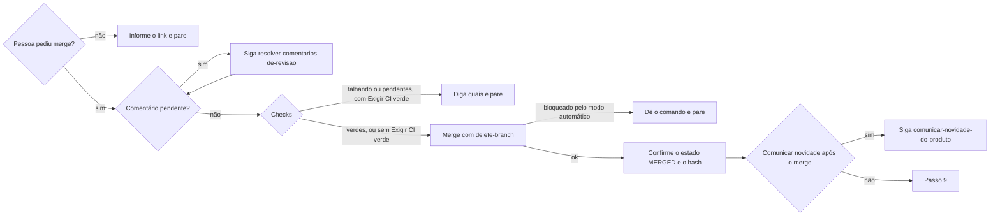

# Criar pull request

## Parâmetros de configuração

Leia cada valor nas instruções do projeto: primeiro na entrada com o nome desta habilidade, depois na entrada `Global`. Quando um valor não estiver lá, use o padrão abaixo. `Repositório` vem do remoto `origin` quando as instruções não dizem.

```yaml
"Repositório": ""
"Branch base": "main"
"Tipo de merge": "squash"
"Idioma do PR": "inglês"
"Comando de testes": ""
"Comando de build": ""
"Timeout do push (ms)": 600000
"Duração do hook de pre-push (min)": 0
"Exigir CI verde": "sim"
"Comunicar novidade após o merge": "sim"
"Modo de aprendizado": "perguntar"
```

## Instruções

Nada entra na `Branch base` sem pull request. Nunca dê push na `Branch base`, nem com pedido explícito. Nunca dê force-push na `Branch base`. Toda mudança chega por PR mesclado com `Tipo de merge`.

### Passo 1

Se a branch atual for a `Branch base`, crie uma branch a partir da `Branch base` remota atualizada antes de qualquer commit, sem rastrear a base. Prefixo igual ao tipo do commit, por exemplo `fix/`, `chore/` ou `docs/`.

### Passo 2

Antes do commit, rode o `Comando de testes` e o `Comando de build` quando existirem. Se a mudança corrige um bug, confirme que o teste novo falha sem a correção e passa com ela. Guarde o hash do commit que passou nas duas verificações.

### Passo 3

Commite seguindo `criar-commit`.

### Passo 4

Se a branch já tem PR, confira o estado dele antes de atualizar. Se já foi mesclado, a branch remota foi apagada: comece uma branch nova a partir da `Branch base` remota e leve só os commits que ficaram fora do merge.
Atualize a branch com rebase sobre a `Branch base` remota. Nunca faça merge da base na branch nem crie commit com assunto `merge:`. O squash do PR não é motivo para mesclar a base antes. Resolva conflitos nos commits rebaseados. Se a branch já foi publicada, no Passo 5 publique o rebase com force-with-lease só nessa branch e somente após pedido explícito.

### Passo 5

Só publique com pedido explícito. Pedir "faça o PR", "sobe isso" ou "coloca na main" já autoriza o push da branch, nunca da `Branch base`. Se `Duração do hook de pre-push (min)` for maior que zero, avise antes quanto o hook leva, para a pessoa não achar que travou.
Se o commit a publicar é o mesmo que passou no Passo 2, publique sem o hook e diga isso na resposta. Se houve outro commit depois, deixe o hook rodar, em segundo plano, com `Timeout do push (ms)`.
Teste antes o acesso ao remoto com a credencial do `gh`. Faça o push com essa credencial.

### Passo 6

Abra o PR contra a `Branch base` no `Repositório`. Título igual ao assunto do commit. Corpo em `Idioma do PR`. Se o repositório tiver um template de pull request, siga as seções dele e marque as caixas conforme o que foi feito. Termine com a linha de atribuição da sessão. Mande o link na resposta.

### Passo 7

Depois de abrir, leia o status do PR pelas ferramentas de PR do app e vincule o PR se ele não aparecer. Não fique consultando o CI em loop.

### Passo 8



Comentário pendente é thread de revisão sem resolver, revisão que pede mudança ou comentário da conversa sem resposta, de pessoa ou de bot. Aviso de bot que só informa, como link de preview, não conta. Thread que espera decisão da pessoa segura o merge até ela decidir.
Leia os checks uma vez. Se estiverem pendentes, não espere em loop: diga quais faltam e pare. Com `Exigir CI verde` igual a `não`, mescle mesmo assim e diga na resposta quais checks não passaram.
Mescle só com `Tipo de merge`. Se o modo automático negar o merge, não tente de outro jeito: nada de auto-merge, API ou outra ferramenta. Entregue o comando pronto e diga que a decisão é da pessoa.
Com `Comunicar novidade após o merge` igual a `sim`, siga `comunicar-novidade-do-produto` para o PR mesclado. Faça o mesmo quando a pessoa avisar que mesclou: confirme o estado MERGED antes.

### Passo 9

Na resposta final, diga o estado de cada etapa: commit, push, PR, CI e merge. Se perguntarem "já mesclou?", responda primeiro sim ou não e depois o que falta.

### Passo 10

Ao terminar, siga `evoluir-habilidade` conforme `Modo de aprendizado`.

## Problemas comuns

### Push parado sem saída

Se você der push por HTTPS e o comando ficar minutos sem saída, o helper de credencial do sistema está esperando um prompt que nunca aparece.

1. Encerre o push parado.
2. Teste o acesso ao remoto com prompt de terminal desligado e a credencial do `gh`.
3. Refaça o push com a mesma credencial.

### Push estoura o tempo da ferramenta

Se você rodar o push em primeiro plano com o tempo padrão, o hook de pre-push passa do limite e o comando vai para segundo plano sem aviso.

1. Rode o push com `Timeout do push (ms)` ou em segundo plano.
2. Avise a pessoa quanto tempo vai levar.
3. Espere a notificação. Não fique consultando em loop.

### Pessoa sem notícia

Se você esperar o hook ou o CI sem dizer nada, a pessoa entende que você está enrolando.

1. Antes de cada espera longa, diga o que está rodando e quanto tempo leva.
2. Se o passo repete uma verificação já feita no mesmo commit, pule e diga isso.

### Merge negado

Se você repetir o merge por outro caminho depois que o modo automático negou, está contornando a decisão.

1. Pare.
2. Entregue o comando de merge pronto.
3. Diga que a pessoa pode mesclar pelo botão do PR ou liberar o comando nas permissões.

## Exemplos de entrada e saída

Estes exemplos ilustram fatos. Eles podem não estar no data source.

### Faça o PR pra corrigir isso

Branch `fix/…` a partir da base, testes e build no commit, commit no idioma do projeto, push com a credencial do `gh`, PR aberto e o link na resposta. Sem merge, porque a pessoa não pediu.

### Só coloca isso na main

O pedido autoriza push e merge. Push sem o hook, porque o commit já passou em testes e build, PR aberto, merge com `Tipo de merge`. Se o modo automático negar, o comando de merge vai pronto na resposta.

## Casos-limite

- Já existe PR aberto para a branch: não abra outro, atualize a branch e dê o link do existente.
- O PR da branch já foi mesclado: não dê rebase nem push nessa branch. Os commits dela já estão na `Branch base` pelo squash, e o push recria a branch apagada.
- A branch atual tem trabalho de outra tarefa: comece a nova branch da `Branch base` remota, não da branch atual.
- O teste novo passa também sem a correção: o teste não cobre o bug. Reescreva antes do commit.
- A pessoa pede para não commitar: pare antes do Passo 3.
- A pessoa pede para subir direto na `Branch base`: não suba. Abra o PR e explique a regra.

## Pegadinhas

- `git pull --rebase` numa branch já publicada rebaseia sobre a própria branch remota, não sobre a `Branch base`. Use o fetch e rebase do Passo 4.
- `git switch -c <branch> origin/<base>` faz a branch rastrear a base. Use `--no-track` e publique com `push -u origin <branch>`.
- O push por HTTPS pode travar para sempre no helper de credencial do macOS. A credencial do `gh` funciona.
- Não existe `timeout` no macOS. Use o timeout da ferramenta ou rode em segundo plano.
- Um hook de pre-push pode rodar também no push que só apaga uma branch remota.
- Leia nas instruções do projeto os checks que o PR recebe e as limitações de cada integração.

## Scripts disponíveis

- `Comando de testes` e `Comando de build`: verificações do Passo 2.
- `git fetch origin && git switch --no-track -c <branch> origin/<Branch base>`: Passo 1.
- `gh pr list --repo <Repositório> --head <branch> --state all --json number,state`: estado do PR no Passo 4.
- `git fetch origin && git rebase origin/<Branch base>`: Passo 4.
- `GIT_TERMINAL_PROMPT=0 git -c credential.helper= -c 'credential.helper=!gh auth git-credential' ls-remote origin HEAD`: teste de acesso do Passo 5.
- `LEFTHOOK=0 GIT_TERMINAL_PROMPT=0 git -c credential.helper= -c 'credential.helper=!gh auth git-credential' push -u origin <branch>`: push sem o hook. Tire o `LEFTHOOK=0` para rodar o hook.
- `gh pr create --repo <Repositório> --base <Branch base> --head <branch> --title "<assunto>" --body "<corpo>"`: Passo 6.
- `gh api graphql -f query='query{repository(owner:"<dono>",name:"<nome>"){pullRequest(number:<número>){reviewDecision reviewThreads(first:100){nodes{isResolved}}}}}'`: threads sem resolver e pedido de mudança do Passo 8.
- `gh pr checks <número> --repo <Repositório>`: checks do Passo 8.
- `gh pr merge <número> --repo <Repositório> --<Tipo de merge> --delete-branch`: Passo 8.

1. Rode as verificações, depois o rebase, o teste de acesso, o push, a criação do PR e, só com pedido, os comentários, os checks e o merge.
