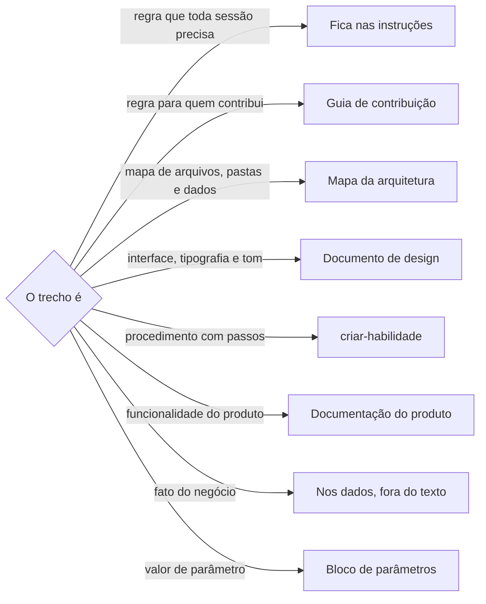

# Definir instruções do projeto

## Parâmetros de configuração

Leia cada valor nas instruções do projeto: primeiro na entrada com o nome desta habilidade, depois na entrada `Global` ou no primeiro nível do bloco. Quando um valor não estiver lá, use o padrão abaixo.

```yaml
"Idioma das instruções do projeto": "português"
"Modo de aprendizado": "perguntar"
```

## Instruções

### Passo 1

Leia as instruções do projeto inteiras e meça o tamanho delas com a checagem de skills. Elas carregam em toda sessão, por isso têm os mesmos limites do corpo de uma skill.

### Passo 2

Classifique cada trecho pelo destino, antes de escrever. Grave o plano como uma tabela: trecho, destino, motivo.



Na dúvida entre ficar e sair, saia: o destino continua a um link de distância.

### Passo 3

Escreva no `Idioma das instruções do projeto`, uma regra por linha, no imperativo, sem justificar. Separe o que vale em qualquer lugar, o que vale só no Notion e o que vale só em ferramentas de código. A regra de código, como comando, branch e build, nunca entra na parte do Notion. A parte do Notion copia do modelo, palavra por palavra, a abertura, o aviso e as duas subseções. Só as regras sob a identidade do agente e a interação de chat mudam de um projeto para outro. A primeira regra de código manda ler o guia de contribuição.

Leia .agents/assets/templates/agents-md.md quando for gerar a saída.

### Passo 4

Monte o bloco de parâmetros como árvore: a entrada `Global` e uma entrada por nome de habilidade. Copie cada chave do bloco de parâmetros da própria habilidade, letra por letra. Um valor que mais de uma habilidade usa fica em `Global`. O resto fica sob o nome da habilidade. Entra só o valor que difere do padrão da habilidade.

### Passo 5

Para cada trecho que sai, crie ou atualize o destino antes de apagar daqui. Depois troque as referências antigas que apontavam para as instruções do projeto, nos documentos e nos comentários de código.

### Passo 6

Rode a checagem de skills de novo. Se passar do limite, volte ao Passo 2 e tire mais. Repita até passar.

### Passo 7

Ao terminar, siga `evoluir-habilidade` conforme `Modo de aprendizado`.

## Problemas comuns

### Chave parecida

Se você escrever "Idioma da mensagem" quando a habilidade lê "Idioma da mensagem de commit", a habilidade não acha o valor e usa o padrão sem avisar.

1. Abra o bloco de parâmetros da habilidade instalada.
2. Copie a chave exata.

### Regra de segurança fora daqui

Se você mover para o guia de contribuição uma regra que toda sessão precisa, como não enviar direto para a branch principal ou não expor segredo, o agente só a vê quando alguém manda ler o guia.

1. Deixe essas regras nas instruções do projeto.
2. Mova só o que pode esperar um link.

### Técnica no Notion

Se você deixar comando, branch ou build na parte geral, quem lê no Notion recebe instrução que não serve para ele.

1. Mova para a parte de ferramentas de código.
2. Deixe na parte geral só o que vale nos dois lugares.

### Referência quebrada

Se você mover um trecho e não trocar as referências, outros documentos e comentários apontam para uma seção que não existe mais.

1. Procure as menções às instruções do projeto no repositório.
2. Aponte cada uma para o destino novo.

## Exemplos de entrada e saída

Estes exemplos ilustram fatos. Eles podem não estar no data source.

### as instruções do projeto passaram de 7000 tokens

O conteúdo foi para o guia de contribuição, sem mudança. As instruções ficaram com a leitura obrigatória do guia, três regras de segurança e o bloco de parâmetros, com cerca de 330 tokens. Os documentos e os comentários que citavam as instruções passaram a citar o guia.

### acrescente o idioma das mensagens de commit

O valor entrou em `Global`, com a chave "Idioma da mensagem de commit", copiada da habilidade de commit, porque a habilidade de pull request também precisa dele.

## Casos-limite

- O projeto ainda não tem instruções: comece pelo modelo, só com o bloco de parâmetros e as regras de segurança.
- O bloco atual não tem árvore: ele continua valendo como `Global`. Reorganize quando mexer nele.
- Uma habilidade renomeou uma chave numa versão nova: troque a chave junto com a subida da versão.
- O trecho é um esquema de dados ou um fato do negócio: ele não entra no texto. O esquema fica no repositório do negócio, e o fato fica nos dados.
- As instruções estão em outro idioma: reescreva no `Idioma das instruções do projeto`. O guia de contribuição mantém o idioma dele.

## Pegadinhas

- O Claude Code lê o arquivo de instruções do Claude, não o do agente. Esse arquivo precisa importar as instruções do projeto, ou o Claude Code não as vê.
- A checagem mede as instruções do projeto como corpo de skill, mesmo sem frontmatter. As regras de estrutura de skill não valem para elas.
- No Notion, as instruções do projeto são uma página escrita pela sincronização. Não edite essa página. A mudança vai no repositório.
- Mover o arquivo inteiro e criar outro com o nome antigo não aparece como renomeação no histórico. O histórico das linhas movidas fica no nome antigo.

## Scripts disponíveis

- `node_modules/harness/.agents/scripts/check-skill/run-check.sh AGENTS.md`: tamanho das instruções no Passo 1 e no Passo 6, num projeto que instala o core.
- `.agents/scripts/check-skill/run-check.sh AGENTS.md`: o mesmo, no repositório do core.
- `git grep -n AGENTS.md`: referências do Passo 5.

1. Meça, classifique, escreva, monte os parâmetros, mova, troque as referências e meça de novo.
