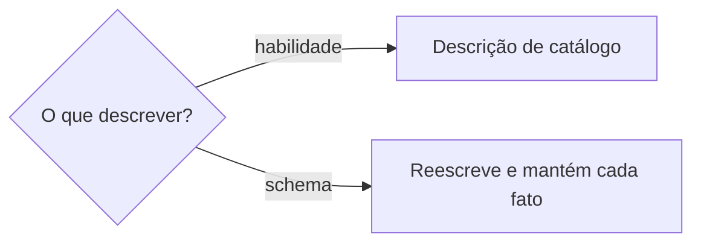

# Descrever habilidade ou schema

## Parâmetros de configuração

```yaml
"Tokens do catálogo": 100
"Caracteres da descrição": 1024
```

## Instruções

### Passo 1

Exija a descrição atual, ou o aviso de que ainda não existe, e as consultas da pessoa. Se faltar algum, peça. Não invente consulta.



No schema, leia a descrição que já está. Reescreva juntando o fato novo. Cada fato que já estava permanece, na descrição do schema e na de cada propriedade. Não substitua por uma frase mais curta. O começo `Use essa habilidade sempre que` fica na habilidade. No schema, a descrição diz o que a fonte é. Sem descrição anterior, escreva a primeira com o fato que a pessoa passou. O nome do banco e o nome da propriedade, inclusive o antigo, não entram na descrição. O nome antigo fica no mapeamento.

### Passo 2

Escreva no imperativo. A descrição começa com `Use essa habilidade sempre que`. Esse começo é o objetivo. Não escreva `Essa habilidade faz`.
Fale da intenção de quem pede, não da mecânica interna. Liste os contextos em que a skill vale, inclusive quando a pessoa não nomeia o domínio. Feche com `NÃO use para` e o que fica de fora.
Não repita o nome da skill. No Notion, Usar automaticamente carrega os gatilhos da propriedade Descrição. O roteador decide por esse texto se carrega a skill. O procedimento fica no corpo, para não repetir instrução em cada conversa. Exemplo de prompt fica em `Exemplos de entrada e saída`.

### Passo 3

Mantenha a descrição curta: algumas frases ou um parágrafo curto. O limite do formato é `Caracteres da descrição`. Nome e descrição, juntos, não passam de `Tokens do catálogo`. Se passar, corte a mecânica e mantenha o gatilho e o `NÃO use para`.

### Passo 4

O teste de disparo garante que a skill carregue nos momentos certos. Peça as consultas. Não invente.
Deve disparar: a tarefa óbvia e o pedido parafraseado, a mesma intenção em outras palavras. Na paráfrase, varie o quanto a pessoa nomeia o domínio, o detalhe e o número de passos.
Não deve disparar: o tópico sem relação e o quase-acerto cuja tarefa a skill não cobre. Se o propósito inclui essa tarefa, o quase-acerto muda para o lado que deve disparar.
No total, cerca de 20 consultas, 8 a 10 de cada lado, já com esses quatro tipos.
Grave cada uma no array `evals` de `evals/evals.json`, com `id`, `prompt`, `expected_output`, `files` e `should_trigger`. `files` fica vazio quando não há arquivo. O prompt é a consulta. `should_trigger` diz se deve disparar. O resultado esperado descreve, para uma pessoa, se a skill é carregada ou não.
Prompt real traz contexto pessoal, detalhe, linguagem casual, abreviação ou erro de digitação. Um pedido simples de um passo pode não disparar mesmo com a descrição certa, porque o agente resolve com ferramenta básica. Não estique a descrição para perseguir esse pedido.

### Passo 5

Separe cerca de 60% para treino e 40% para validação. Os dois lados entram nos dois grupos, na mesma proporção. Embaralhe uma vez e mantenha o recorte.
No mesmo array, marque `split` como `train` ou `validation`. Não crie outro arquivo de eval.

### Passo 6

Rode cada consulta 3 vezes, em contexto limpo. Disparou se o agente carregou a skill. Não disparou se seguiu sem consultá-la. A taxa é a fração das rodadas em que disparou.
Passa se `should_trigger` é verdadeiro e a taxa passa de 0,5, ou se é falso e a taxa fica abaixo de 0,5.
A rodada se repete. Proponha um script testado uma vez. Com o aceite, grave em `scripts/` quando só esta skill usa, ou em `.agents/scripts/<nome>/` quando várias usam, e passe a chamá-lo. A detecção depende do cliente. Se o cliente permitir, pare assim que a skill for carregada ou o trabalho começar sem ela.

### Passo 7

Avalie treino e validação. Só a falha do treino guia a mudança. A validação fica de fora da revisão.
Subdisparo: a skill não carrega quando deveria, a pessoa liga ela à mão, ou pergunta quando usar. Acrescente detalhe e nuance, inclusive o termo técnico. Não copie palavra casual da consulta que falhou: cubra a categoria.
Sobredisparo: a skill carrega em consulta sem relação, a pessoa desliga ela, ou o propósito confunde. Aperte o `NÃO use para` e seja específico.
Se travar, mude a estrutura da frase. Confira os limites do Passo 3.
Resultado inconsistente, falha de chamada e correção da pessoa ficam em `evoluir-habilidade`.
Repita até o treino passar ou a melhora parar. Cinco rodadas costumam bastar. Se não melhorar, a consulta pode estar fácil, difícil ou mal rotulada.
Escolha a rodada com a maior taxa de acerto na validação. Pode ser uma rodada anterior.

### Passo 8

Grave a descrição escolhida na skill. Confira os limites do Passo 3. Teste à mão alguns prompts. Para um teste mais firme, peça 5 a 10 consultas novas, dos dois lados, fora desta otimização, e rode o script.
A qualidade da saída fica em `evoluir-habilidade`. A revisão que só sinaliza fica em `revisar-habilidade`.
Antes de aceitar, confira:

1. A descrição começa com `Use essa habilidade sempre que` e fala da intenção de quem pede. Não repete o nome da skill nem traz exemplo de prompt.
2. Cobre o caso em que a pessoa não nomeia o domínio.
3. Fecha com `NÃO use para`.
4. Cabe em `Caracteres da descrição`, e nome mais descrição cabem em `Tokens do catálogo`.
5. O treino passa, ou a melhora parou e a validação escolheu a rodada.

## Problemas comuns

### Descrição de schema substituída

Se você trocar a descrição do schema por uma frase nova, o fato que já estava sai.

1. Leia a descrição que já está, no schema e em cada propriedade.
2. Reescreva com o fato novo e com cada fato que já estava.
3. Não apague o que a frase já nomeava.

### Descrição sem o começo

Se você abrir com outra frase, o roteador do Notion não acha a skill.

1. Comece com `Use essa habilidade sempre que`.
2. O restante dessa frase é o objetivo.
3. Não repita o nome da skill. O exemplo de prompt fica no corpo.

### Descrição no indicativo

Se você escrever `Essa habilidade faz`, o agente não recebe a ordem de quando agir.

1. Reescreva como `Use essa habilidade sempre que`.
2. Feche com `NÃO use para`.

### Descrição de implementação

Se você descrever a mecânica interna, o agente não casa com o pedido da pessoa.

1. Troque pela intenção de quem pede.
2. Inclua o caso em que a pessoa não nomeia o domínio.

### Descrição larga demais

Se você omitir `NÃO use para`, a skill carregar em consulta sem relação, a pessoa desligar ela, ou o propósito confundir, a skill dispara fora do escopo.

1. Feche com o que fica de fora e seja específico.
2. Teste com o quase-acerto que não deve disparar.

### Subdisparo

Se você vir a skill fora quando deveria carregar, a pessoa ligando ela à mão, ou uma pergunta sobre quando usar, a descrição está curta demais.

1. Acrescente detalhe e nuance.
2. Inclua o termo técnico que a pessoa usa.
3. Deixe de fora a palavra casual da consulta que falhou. Cubra a categoria.

### Teste genérico

Se você testar com um prompt como "processe estes dados", ou inventar a consulta, o disparo não reflete o pedido real.

1. Peça o prompt que a pessoa escreveria.
2. Não invente essa consulta.

### Consulta fácil demais

Se você testar só a tarefa óbvia, ou deixar de fora o tópico sem relação, o teste não mostra se a skill carrega nos momentos certos.

1. No lado que deve disparar, inclua a tarefa óbvia e o pedido parafraseado.
2. No lado que não deve, inclua o tópico sem relação e o quase-acerto que a skill não cobre.
3. Peça essas consultas. Não invente.

### Palavra da falha

Se você copiar para a descrição uma palavra da consulta que falhou, a descrição acerta essa frase e falha na seguinte.

1. Tire a palavra específica.
2. Cubra a categoria que a consulta representa.
3. Meça de novo na validação, sem usá-la para reescrever.

### Validação na revisão

Se você reescrever a descrição olhando a validação, a descrição gruda nesse conjunto.

1. Reescreva só com falha do treino.
2. Deixe a validação para escolher a rodada.

### Eval separado

Se você gravar as consultas de disparo em outro arquivo, o caso sai do padrão.

1. Grave no array `evals` de `evals/evals.json`.
2. Use `id`, `prompt`, `expected_output`, `files`, `should_trigger` e `split`.
3. Apague o outro arquivo.

## Exemplos de entrada e saída

Estes exemplos ilustram fatos. Eles podem não estar no data source.

### A descrição do schema é "lista de clientes, com contato e endereço de entrega". A pessoa pede para gravar que a lista também guarda fornecedores.

lista de clientes, com contato e endereço de entrega, e lista de fornecedores, com os mesmos dados.

### a descrição é "Processa CSV." A pessoa traz "faz um gráfico das vendas desse csv", que deve disparar, e "sobe cada linha desse csv pro postgres", que não deve.

Use essa habilidade sempre que a pessoa trouxer CSV, TSV ou planilha e quiser explorar, resumir, limpar ou gerar gráfico, mesmo sem dizer análise. NÃO use para editar fórmula de planilha nem carregar linha em banco. As falhas do treino ajustam o texto. A taxa na validação escolhe a versão.

## Casos-limite

- A descrição começa com o nome da skill ou com um exemplo de prompt: recomece com `Use essa habilidade sempre que`. O exemplo vai para o corpo.
- O pedido é de um passo e o agente já resolve sozinho: não estique a descrição para forçar o disparo.
- Nome e descrição passam de `Tokens do catálogo`, ou a descrição passa de `Caracteres da descrição`: corte a mecânica e mantenha o gatilho e o `NÃO use para`.
- Há menos de 20 consultas, ou falta tarefa óbvia, paráfrase, tópico sem relação ou quase-acerto: peça o que falta. Não invente.
- Os dois lados não estão nos dois grupos: refaça o recorte, com mistura proporcional, e mantenha esse recorte.
- A melhor taxa está numa rodada anterior: use essa descrição.
- O cliente não mostra se a skill foi carregada: peça o registro antes de calcular a taxa.
- A descrição já passa no treino e na validação: pare. A qualidade da saída fica em `evoluir-habilidade`.
- A pessoa não nomeia o domínio: a descrição cobre essa formulação.
- A consulta está em outro arquivo: mova para `evals/evals.json` e apague o arquivo.
- O pedido veio do Notion: não edite a página. A escrita segue `publicar-habilidade`.
- A descrição do schema já existe: reescreva e mantenha cada fato. Não substitua.
- A descrição do schema ainda não existe: escreva a primeira com o fato que a pessoa passou.
- A descrição do schema nomeia um banco ou uma propriedade, inclusive um nome antigo: tire o nome. O fato permanece. O nome antigo fica no mapeamento.

## Pegadinhas

- O nome da skill parece obrigatório na descrição. O roteador já tem o nome. A descrição começa com o objetivo.
- Não invente consulta de disparo. Peça o prompt da pessoa.
- Tópico sem relação parece consulta inútil. Ele mostra que a skill fica de fora. O quase-acerto mostra a fronteira.
- Não copie para a descrição uma palavra casual da consulta que falhou. O termo técnico que a pessoa usa entra.
- A validação não guia a reescrita. Ela escolhe a rodada.
- Pedido de um passo que o agente resolve sozinho não dispara, mesmo com a descrição certa.
- Consulta de disparo entra em `evals/evals.json`, com `should_trigger` e `split`. Não crie outro arquivo.
- Pedido vindo do Notion parece permissão para gravar a página. A página é só leitura. Siga `publicar-habilidade`.
- Uma descrição nova parece mais clara que a antiga. No schema, a frase nova entra junto. O fato que já estava permanece.
- O nome antigo do banco parece parte do que a fonte é. Ele fica no mapeamento. A descrição fica com o que o dado é.

## Scripts disponíveis

- Nenhum.

1. Não há script para executar.
