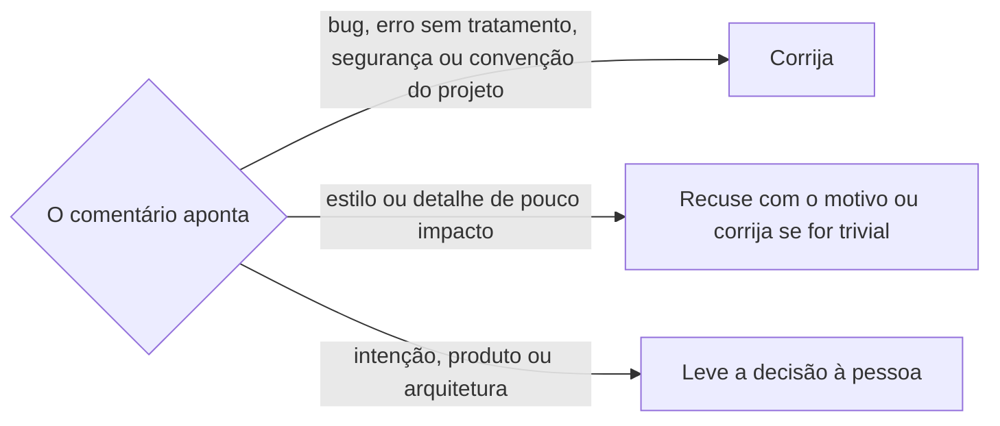

# Resolver comentários de revisão

## Parâmetros de configuração

Leia cada valor nas instruções do projeto. Quando um valor não estiver lá, use o padrão abaixo. `Repositório` vem do remoto `origin` quando as instruções não dizem.

```yaml
"Repositório": ""
"Idioma da resposta": "inglês"
```

## Instruções

### Passo 1

Exija o número ou o link do pull request. Leia todos os lugares onde há comentário: as threads de revisão, com o estado de cada uma; o corpo de cada revisão, inclusive o resumo que um bot publica; e os comentários da conversa do PR. Aviso de bot que só informa, como link de preview ou nota de release, fica lido e sem ação.

### Passo 2

Confira cada comentário contra o código atual do PR, não contra o commit em que ele foi escrito. Marque cada um como válido, já corrigido, desatualizado ou duplicado. Comentário que repete outro, inclusive de outro bot, vira uma correção só.

### Passo 3

Decida cada comentário válido pelo que ele aponta. O bot vê só o diff. Use as instruções do projeto, as ADRs e o histórico para julgar se ele tem razão.



### Passo 4

Corrija na branch do PR, seguindo `criar-commit`. Lógica do projeto ganha ou ajusta teste. Envie a branch, seguindo `criar-pull-request`, antes de responder, para que o commit citado na resposta já esteja no PR.

### Passo 5

Se a decisão vale além deste PR, grave a lição nas instruções do projeto e commite, seguindo `criar-commit`, antes de responder. Uma recusa que vai se repetir também entra, para não ser rediscutida. Correção pontual fica só na resposta.

### Passo 6

Responda cada thread em `Idioma da resposta`: o que mudou, com o commit, ou por que não muda. Comentário desatualizado ganha a explicação do que mudou desde então. Depois de responder, resolva a thread. Thread que espera decisão da pessoa fica aberta.

### Passo 7

Entregue um placar curto: aceitos, recusados, desatualizados e abertos, por autor. Diga se ainda há thread aberta. Devolva para quem chamou. O merge segue `criar-pull-request`, que decide também pelos checks.

## Problemas comuns

### Comentário desatualizado tratado como atual

Se você corrigir o que um comentário apontou sem conferir o código de agora, a correção desfaz uma mudança que já resolveu o caso.

1. Leia o arquivo no último commit do PR.
2. Se o problema não está mais lá, responda o que mudou e resolva.

### Thread resolvida sem resposta

Se você resolver a thread sem responder, quem comentou não sabe o que foi feito.

1. Responda antes de resolver.
2. Diga o commit ou o motivo.

### Tudo que o bot pede vira mudança

Se você aceitar cada sugestão de bot, o PR cresce com estilo e detalhe de pouco impacto, e o comentário que importa se perde.

1. Classifique pelo Passo 3.
2. Recuse o detalhe com uma frase.
3. Se a recusa se repete, grave nas instruções do projeto.

### Decisão de produto tomada sozinha

Se você resolver um comentário sobre intenção, produto ou arquitetura sem perguntar, a decisão humana não acontece.

1. Leve a pergunta à pessoa, com as opções.
2. Deixe a thread aberta até ela decidir.

### Resposta em dobro

Se você repetir o envio de uma resposta depois de uma falha de rede, a thread pode ganhar duas respostas iguais.

1. Antes de responder de novo, liste as respostas que a thread já tem.
2. Responda só se a sua não estiver lá.

### Resumo do bot esquecido

Se você ler só as threads, o resumo que o bot publica no corpo da revisão fica sem resposta, e ele pode trazer um achado que não virou thread.

1. Leia o corpo de cada revisão.
2. Trate o achado do resumo como os outros.

## Exemplos de entrada e saída

Estes exemplos ilustram fatos. Eles podem não estar no data source.

### confira a análise do bot no PR de release, ainda faz sentido?

O bot pedia para segurar a release porque uma skill apontava para outras que ainda não existiam. No commit atual, todas existiam e a checagem passava. Respondi o que mudou desde a revisão e resolvi a thread. Placar: um desatualizado.

### o bot comentou no catálogo que a entrada de uma skill contradiz a própria skill.

A entrada dizia que os exemplos usam `dt` e `dd`, e a skill e a checagem pedem heading e parágrafo. Corrigi num PR de documentação, respondi com o link e resolvi. Placar: um aceito.

### o bot pede frontmatter num arquivo que o gerador de release reescreve.

Recusei: o gerador reescreve o arquivo a cada release. Gravei a exceção nas instruções do projeto, respondi e resolvi. Placar: um recusado, com a lição registrada.

## Casos-limite

- Uma pessoa pergunta algo que só ela pode decidir: pergunte e não resolva.
- Dois bots apontam o mesmo problema: uma correção, uma resposta em cada thread.
- O comentário fica na conversa do PR, fora de uma thread: responda na conversa. Ele não tem como ser resolvido.
- Um push novo faz o bot revisar de novo: leia as threads novas antes do merge.
- Um bot comenta por causa de um check que falhou: trate como os outros. A decisão de mesclar com check falhando fica com `criar-pull-request`.

## Pegadinhas

- O GitHub marca como `outdated` a thread cujo trecho mudou. Ela continua aberta até alguém resolver.
- O resumo do bot é o corpo da revisão, não uma thread. Ele não tem botão de resolver.
- Resolver pede o id da thread, que vem da API GraphQL. O id do comentário, da API REST, não serve.
- A resposta vai como réplica do primeiro comentário da thread. Comentário novo no PR não fica na thread.
- Aprovar o PR não resolve as threads dele.
- A consulta de threads traz uma página. Se `pageInfo.hasNextPage` for verdadeiro, peça a próxima com `after`, antes de dizer que não há mais thread.
- Resposta com apóstrofo quebra `-f body='...'` no shell. Grave a resposta num arquivo e envie com `-F body=@<arquivo>`.

## Scripts disponíveis

- `gh pr view <número> --repo <Repositório> --json reviews,comments`: revisões e conversa do Passo 1.
- `gh api graphql -f query='query{repository(owner:"<dono>",name:"<nome>"){pullRequest(number:<número>){reviewThreads(first:100){pageInfo{hasNextPage endCursor} nodes{id isResolved isOutdated comments(first:100){nodes{databaseId author{login} path body}}}}}}}'`: threads e respostas.
- `gh api repos/<Repositório>/pulls/<número>/comments/<id do comentário>/replies -F body=@<arquivo da resposta>`: resposta na thread.
- `gh api graphql -f query='mutation{resolveReviewThread(input:{threadId:"<id da thread>"}){thread{isResolved}}}'`: resolução.

1. Leia as revisões, a conversa e as threads.
2. Corrija e commite, inclusive a lição nas instruções do projeto, se for o caso, e envie a branch.
3. Para cada thread, confira as respostas, responda e resolva.
4. Entregue o placar do Passo 7.
