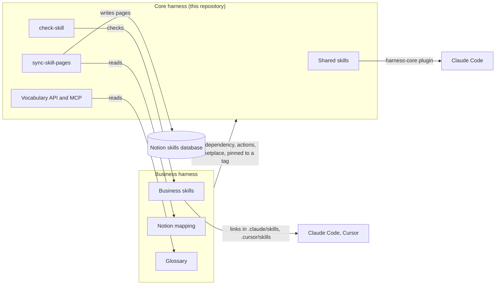

# Architecture Overview

This document is the map of this repository: which files exist, what each part does, and how the parts talk to each other. It is written for agents and people who need to find their way before changing anything. Other documents link here instead of repeating the layout. Update it when a directory, a component, or a boundary changes, not when a skill is added.

This repository is the core harness. A business harness is a separate, private repository that uses it, as decided in `docs/adr/0005-split-the-core-from-business-harnesses.md`.

## 1. Project Structure

```text
harness/
├── .agents/
│   ├── config.yml                  # Defaults; a business harness overrides only the keys that differ
│   ├── mappings/                   # Template of the Notion mapping a business harness copies
│   ├── schemas/                    # JSON Schema of a skill page
│   ├── scripts/
│   │   ├── check-skill/            # Skill checker (Python), run by Lefthook and the check-skill action
│   │   ├── skill-graph/            # Writes .agents/skills/README.md, the Mermaid graph of skills
│   │   ├── skill-folder-icon/      # macOS folder icon for each skill, run by Lefthook
│   │   └── sync-skill-pages/       # Notion sync (TypeScript), run by the sync-skill-pages action
│   └── skills/                     # Shared skills, one <name>/SKILL.md each
│       ├── FEATURES.md             # One entry per skill, written by hand
│       └── README.md               # Generated skill graph; do not edit
├── .claude-plugin/                 # Claude Code plugin harness-core and the harness marketplace
├── .github/
│   ├── actions/                    # Composite actions called by business harnesses
│   │   ├── check-skill/
│   │   └── sync-skill-pages/
│   └── workflows/                  # CI and Release Please for this repository
├── api/                            # Vocabulary API, CLI, and MCP server (TypeScript)
│   ├── cli.ts                      # Writes glossary terms from the command line
│   ├── mcp/                        # MCP server and the launcher the plugin calls
│   ├── routes/                     # One HTTP endpoint per directory
│   └── shared/                     # Glossary access, Zod schemas, HTTP server
├── docs/
│   ├── adr/                        # Architecture decisions
│   └── runbooks/                   # Setup steps, one runbook per tool
├── examples/                       # Files the runbooks copy into a project, pinned as vX.Y.Z
├── default.json                    # Renovate preset extended by business harnesses
├── lefthook.yml                    # Pre-commit checker for this repository
├── AGENTS.md                       # Rules for agents working here
├── ARCHITECTURE.md                 # This map
├── CONTRIBUTING.md                 # Commits, CI, actions, releases
├── FEATURES.md                     # Tools a person or a repository uses directly
├── INSTALL.md                      # Index of the runbooks
├── SECURITY.md                     # Supported runtimes, secrets, reporting
└── TROUBLESHOOTING.md              # Failure diagnosis
```

A business harness has the same `.agents/` layout with its own skills, mappings, and glossary, and `node_modules/harness` holding a pinned release of this repository.

## 2. High-Level System Diagram



## 3. Core Components

### 3.1. Frontend

None. People reach the core through their agent (Claude Code, Cursor), GitHub, and Notion.

### 3.2. Backend Services

#### 3.2.1. Skill checker

- Name: `check-skill`
- Description: Checks each changed `SKILL.md` against the harness rules and the project `.agents/config.yml`, including related skills, Gherkin files, and the skill graph.
- Technologies: Python 3.14
- Deployment: Lefthook on commit; composite action in CI

#### 3.2.2. Notion sync

- Name: `sync-skill-pages`
- Description: Creates or updates one Notion page per changed skill, through the caller's mapping.
- Technologies: TypeScript on Node.js 24, `@notionhq/client`
- Deployment: Composite action on push to the default branch of a business harness

#### 3.2.3. Vocabulary API and MCP

- Name: `vocabulary`
- Description: Reads and writes the glossary of the open project: look up a term, report which tokens of a text exist, insert and update terms.
- Technologies: TypeScript on Node.js 24, Zod
- Deployment: MCP server started by the `harness-core` plugin; local HTTP server on 127.0.0.1; CLI

#### 3.2.4. Claude Code plugin

- Name: `harness-core`
- Description: Ships the shared skills and starts the vocabulary MCP server.
- Technologies: Claude Code plugin manifest
- Deployment: Marketplace `harness` in this repository, or a business marketplace that lists it pinned to a tag

## 4. Data Stores

### 4.1. Files in git

- Name: Skills, configuration, mappings, glossary
- Type: Markdown, YAML, and JSON files
- Purpose: Git is the write source of every skill and setting
- Key Schemas/Collections: `.agents/skills/<name>/SKILL.md`, `.agents/config.yml`, `.agents/mappings/skill-page.notion.json`, `.agents/glossary/<language>.json`

### 4.2. Notion

- Name: Skills database of each business
- Type: Notion data source
- Purpose: Readable copy of the skills for the people of that workspace; only the sync writes it

## 5. External Integrations / APIs

- Notion API: Purpose: publish skill pages. Integration Method: `@notionhq/client` with the business token.
- GitHub: Purpose: pull requests, CI, releases, and composite actions. Integration Method: GitHub Actions and the `gh` CLI.
- Renovate: Purpose: move the pins of the core in business harnesses. Integration Method: the preset in `default.json`.

## 6. Deployment & Infrastructure

- Cloud Provider: GitHub
- Key Services Used: GitHub Actions, GitHub Releases
- CI/CD Pipeline: `.github/workflows/ci.yml` checks and tests; Release Please tags each release. Details are in `CONTRIBUTING.md`.
- Monitoring & Logging: GitHub Actions logs and job summaries

## 7. Security Considerations

- Authentication: The Notion token is a secret of each business harness, passed to the sync action.
- Authorization: The Notion integration sees only the skills database shared with it.
- Data Encryption: Delegated to GitHub secrets and the Notion API over HTTPS.
- Key Security Tools/Practices: This repository is public and holds no token, workspace, database, or business name. Details are in `SECURITY.md`.

## 8. Development & Testing Environment

- Setup: `INSTALL.md`, section "Work in this repository"
- Testing frameworks: `node --test` for TypeScript, Python test scripts for the checker and the graph
- Code quality tools: `tsc --noEmit`, the skill checker, Lefthook

## 9. Future Considerations / Roadmap

- Move the remaining shared skills from business harnesses after their audit.
- Keep the Renovate preset moving every pin, including `.claude/settings.json`.

## 10. Project Identification

- Project Name: haRness (core)
- Repository URL: https://github.com/jimmyandrade/harness
- Primary Contact/Team: Jimmy Andrade
- Date of Last Update: 2026-10-02

## 11. Glossary / Acronyms

- Core harness: this repository, shared by every business.
- Business harness: a private repository with the skills and data of one business.
- Skill: a `SKILL.md` with instructions an agent loads for one kind of task.
- Mapping: the JSON file that names the Notion data source, properties, and status options of one business.
- Glossary: the per-language list of allowed, forbidden, and situational terms of a business.
- Marketplace: the Claude Code catalog that lists plugins to install.
- ADR: Architecture Decision Record, in `docs/adr/`.
- MCP: Model Context Protocol, how agents call the vocabulary tools.
